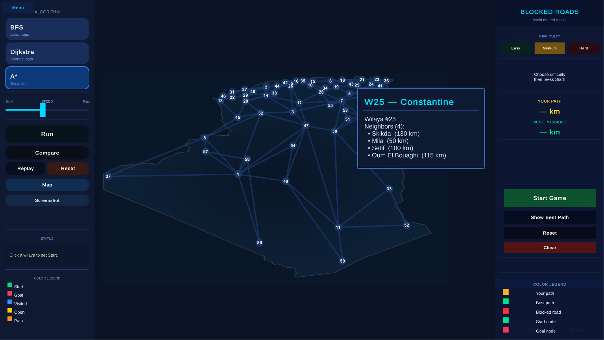
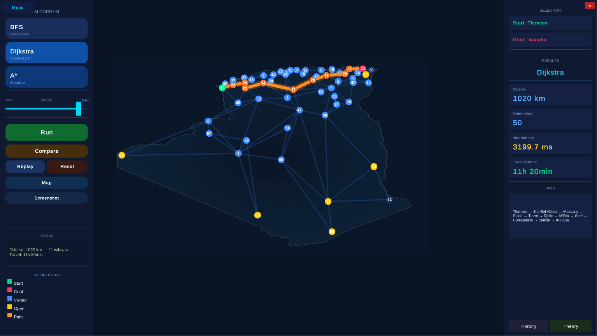
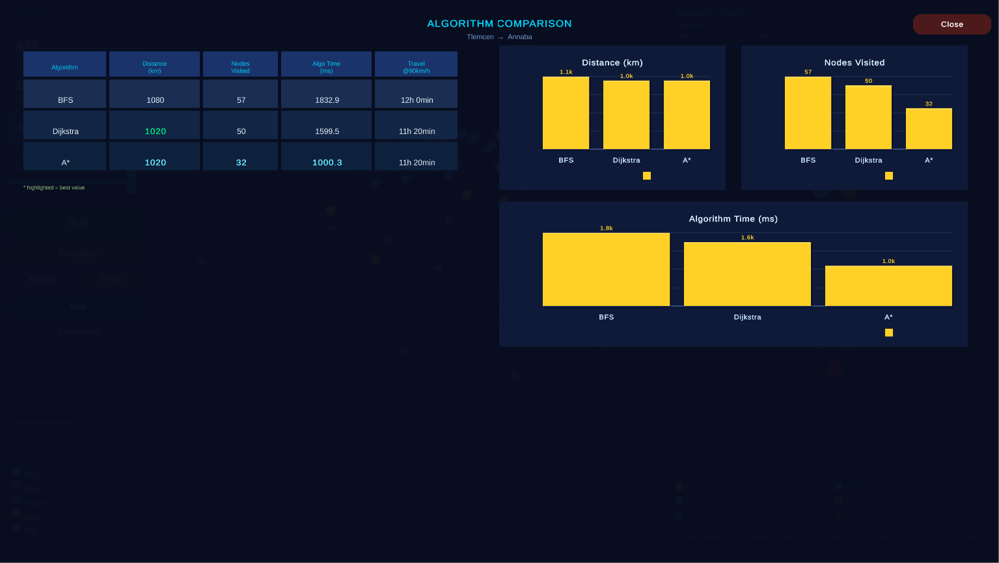
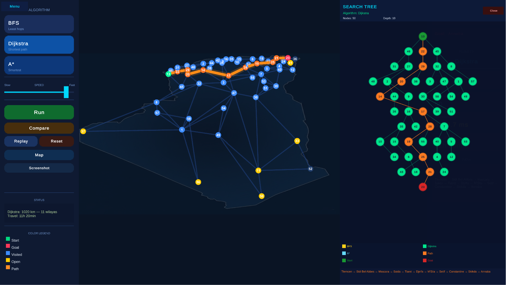

# 🗺️ Algeria Pathfinding Simulator

> Interactive visualization of **BFS**, **Dijkstra** and **A\*** on Algeria's real 48-wilaya road network — built with Unity 2022.3 LTS & C#

---

## 📸 Preview



---

## ✨ Features

| Feature | Description |
|---|---|
| 🗺️ **Real Map** | 48 wilayas with real road distances |
| 🔵 **Step Animation** | Watch each algorithm explore node by node |
| ⚡ **Compare Mode** | Run all 3 algorithms side by side with bar charts |
| 🌳 **Search Tree** | Live visualization of the search tree per depth level |
| 📚 **Theory Panel** | Built-in explanation of BFS, Dijkstra and A\* |
| 🧩 **Road Puzzle** | Draw your own path and compete against Dijkstra |
| 🚧 **Blocked Roads** | Navigate with randomly blocked routes |
| 📋 **History** | Persistent JSON history of all searches |

---

## 🎬 Demo

| Simulation | Compare | Search Tree |
|---|---|---|
|  |  |  |

---

## 🚀 Getting Started

### Prerequisites
- Unity Hub
- Unity **2022.3.x LTS**
- Active Input Handling: **Both** *(Edit → Project Settings → Player)*

### Run in Unity
1. Open `AlgeriaFinal` folder in Unity Hub
2. `File → New Scene → Empty` *(delete all default objects)*
3. `Hierarchy → Create Empty → Add Component → SimulatorController`
4. Press **▶ Play**

### Windows Build
`File → Build Settings → Windows, Mac, Linux → Add Open Scenes → Build And Run`

> If IL2CPP error: `Player Settings → Scripting Backend → Mono`

---

## 🏗️ Architecture

```
AlgeriaFinal/
└── Assets/
    └── Scripts/
        ├── Core/
        │   ├── SimulatorController.cs   # Main orchestrator
        │   ├── Algorithms.cs            # BFS, Dijkstra, A*
        │   ├── GraphMap.cs              # Map builder & renderer
        │   ├── WilayaData.cs            # 48 wilayas + road distances
        │   └── PathResult.cs            # Algorithm output
        ├── UI/
        │   ├── SimulatorUI.cs           # Main UI panels
        │   ├── SearchTreePanel.cs       # Live search tree
        │   ├── TheoryPanel.cs           # Theory module
        │   ├── MenuScreen.cs            # Animated main menu
        │   ├── BarChart.cs              # Comparison charts
        │   └── TooltipUI.cs             # Hover tooltip
        ├── Modes/
        │   ├── PathPuzzle.cs            # Road Network Puzzle
        │   ├── BlockedRoads.cs          # Blocked Roads Puzzle
        │   ├── AlgoRace.cs              # Race Mode
        │   └── HeuristicDemo.cs         # Heuristic comparison
        └── Utils/
            ├── HistoryManager.cs        # JSON persistence
            ├── CameraRig.cs             # Zoom + pan
            └── NodeClicker.cs           # Node interaction
```

---

## 🧠 Algorithms

### BFS — Breadth-First Search
- Explores level by level using a Queue (FIFO)
- **Guarantees**: minimum hops (not minimum distance)
- **Complexity**: O(V + E)

### Dijkstra
- Always expands the node with lowest cumulative cost
- **Guarantees**: shortest distance in km
- **Complexity**: O((V + E) log V)

### A\*
- Dijkstra + heuristic h(n) = Haversine(node, goal)
- **Guarantees**: optimal path (heuristic is admissible)
- **Complexity**: O(E) best case

---

## 🛠️ Tech Stack

- **Engine**: Unity 2022.3.62f3 LTS
- **Language**: C# / .NET Standard 2.1
- **UI**: Unity uGUI (100% procedural, no prefabs)
- **Text**: TextMeshPro
- **Persistence**: JsonUtility + System.IO
- **Platform**: Windows x64 Standalone

---

## 📊 Project Stats

- **19** C# scripts
- **~280 KB** source code
- **58** wilayas with real coordinates
- **0** third-party assets

---

## 📄 License

This project is for academic purposes.
